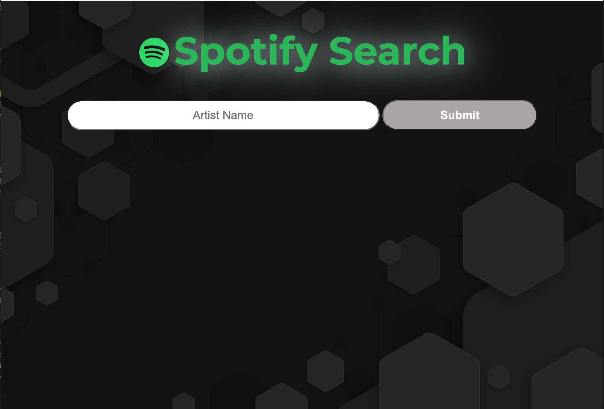
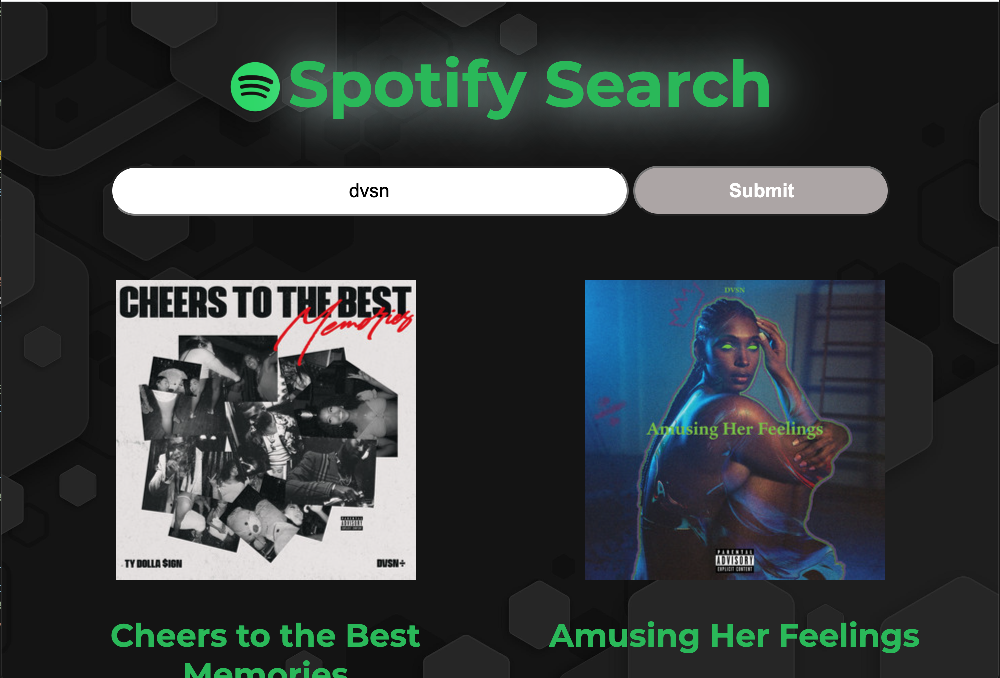
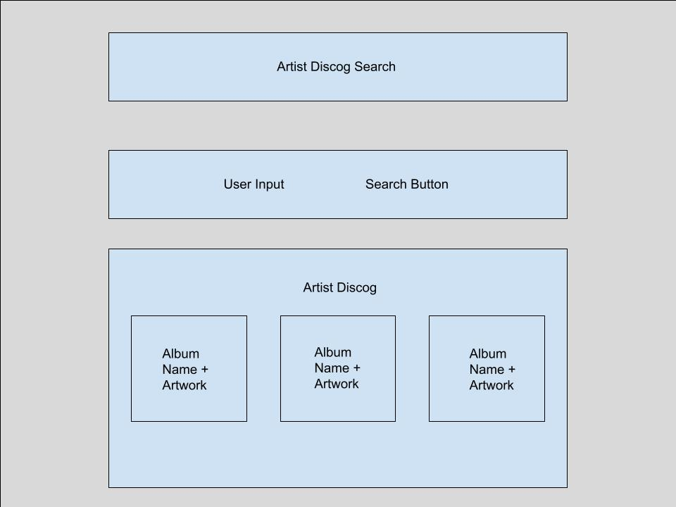

# Spotify Search

#### A site built using Spotify's API to search for an artist and display their discography. A modal will appear when clicking on a single album showing the tracklist of the album. This site is mobile friendly.

## Table of Contents
- [Technologies Used](#technologiesused)
- [Features](#features)
- [Wireframe](#wireframe)
- [Trello](#trello)
- [Deployed App](#deployment)
- [Resources](#resources)
- [Future Implementations](#futureimplementations)

##  Technologies Used
- JavaScript
- jQuery
- AJAX
- HTML
- CSS

##  Features
- User can search for an artist
- User can select an album, showing the albums tracklist
- Randomized homepage background image
- Animation when hitting submit
- Mobile friendly

##  Wireframe

##  Trello
- [Trello](https://trello.com/b/ROT3DfpQ/show-artist-discog-spotify-api)

##  Deployed Link
- [Netlify](https://chipper-puppy-944109.netlify.app/)
  - If you encounter a 404 Error or nothing loads on search it's because the monthly API **call limit (500)** has been reached

##  Resources:
- [MDN](https://developer.mozilla.org/en-US/)
- [w3schools](https://www.w3schools.com/)
- [coolers](https://coolors.co/)
- [usbrandcolors](https://usbrandcolors.com/)
- [freepik](https://www.freepik.com/)

##  Future Implementations
- Audio preview
- Show recent searches
- Autofill dropdown when typing into search bar
